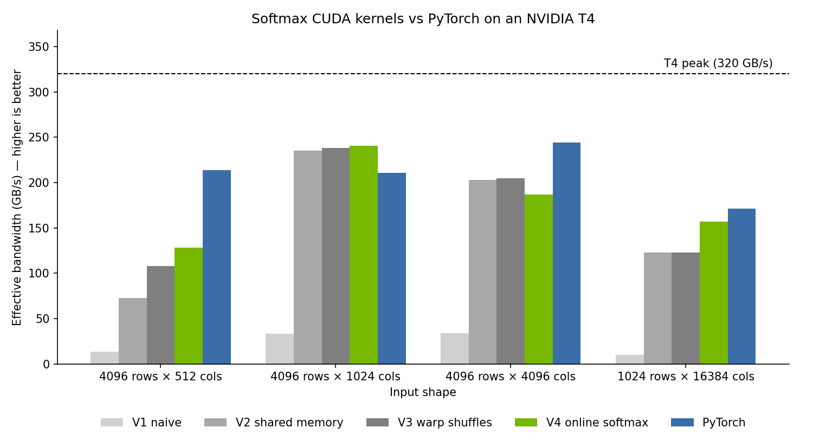

# softmax-cuda

A softmax GPU kernel written in CUDA C++, optimized in four steps, benchmarked against PyTorch, and plugged into Llama 3.2 1B.



## Results

NVIDIA T4, float32, median of 100 runs, input shape 4096 × 1024:

| Version | Technique | Time | Bandwidth | % of PyTorch |
|---|---|---|---|---|
| V1 | One thread per row | 1.002 ms | 33.5 GB/s | 16% |
| V2 | One block per row, shared-memory reduction | 0.143 ms | 235.5 GB/s | 112% |
| V3 | Warp-shuffle reductions | 0.141 ms | 238.3 GB/s | 113% |
| **V4** | **Online softmax (2 memory passes, not 3) + float4 loads** | **0.139 ms** | **240.9 GB/s (75% of peak)** | **114%** |
| PyTorch | `torch.softmax` | 0.159 ms | 210.9 GB/s | 100% |

V4's speed relative to PyTorch depends on row length: **60%** at 512 columns, **114%** at 1024, **77%** at 4096, and **91%** at 16384. Full data is in [results/benchmarks.csv](results/benchmarks.csv), with analysis in [results/NOTES.md](results/NOTES.md).

**Llama 3.2 1B:** V4 replaces softmax in all 16 attention layers and produces identical generated text. Inside the model, softmax got about 10% faster, but softmax is only 5% of the runtime, so the full model is just 0.3% faster (Amdahl's law). Model weights come from [`unsloth/Llama-3.2-1B`](https://huggingface.co/unsloth/Llama-3.2-1B), an ungated mirror of Meta's release; the model ran in float32 with eager attention. ([results](results/llm_results.json))

## What each version changed

- **V1:** each thread handles one whole row. The 32 threads in a warp read addresses one row apart, so memory reads are uncoalesced, and there are too few threads to keep the GPU busy.
- **V2:** a block of 256 threads shares each row. Neighboring threads read neighboring addresses (coalesced), and a shared-memory tree combines the 256 partial results in 8 steps.
- **V3:** warps combine values directly between registers with `__shfl_xor_sync`. That cuts barriers per row from 18 to 2.
- **V4:** online softmax computes the max and the sum in a single pass, so each row is read from memory 2 times instead of 3. 128-bit `float4` loads cut the number of load instructions by 4×.

## Run it

[Open in Colab](https://colab.research.google.com/github/shaashankrg/softmax-cuda/blob/main/run.ipynb) and select a T4 GPU runtime, or run:

```bash
git clone https://github.com/shaashankrg/softmax-cuda.git && cd softmax-cuda
pip install ninja
python tests/test_correctness.py && python bench/bench_kernels.py
```

## Next steps

- **Short rows:** use one warp per row and keep the row in registers. That's a single memory read, and the reductions need no block-wide barriers. This is where PyTorch still wins.
- **fp16/bf16 support:** half precision moves half as many bytes, and real inference uses it.
- **Fuse softmax with the matrix multiply before it**, as FlashAttention does. The attention score matrix then never gets written to memory.
- **Fewer attention layers:** NVIDIA's Nemotron-H models replace most attention layers with Mamba-2 layers, which shrinks how much attention (and softmax) matters in the first place.
